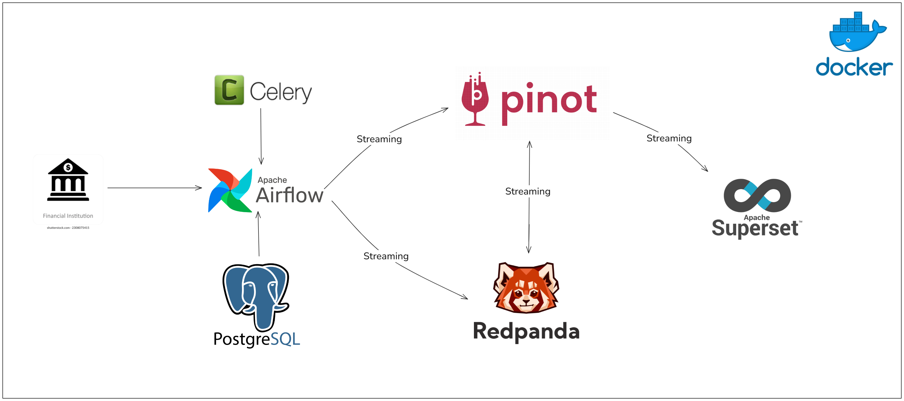
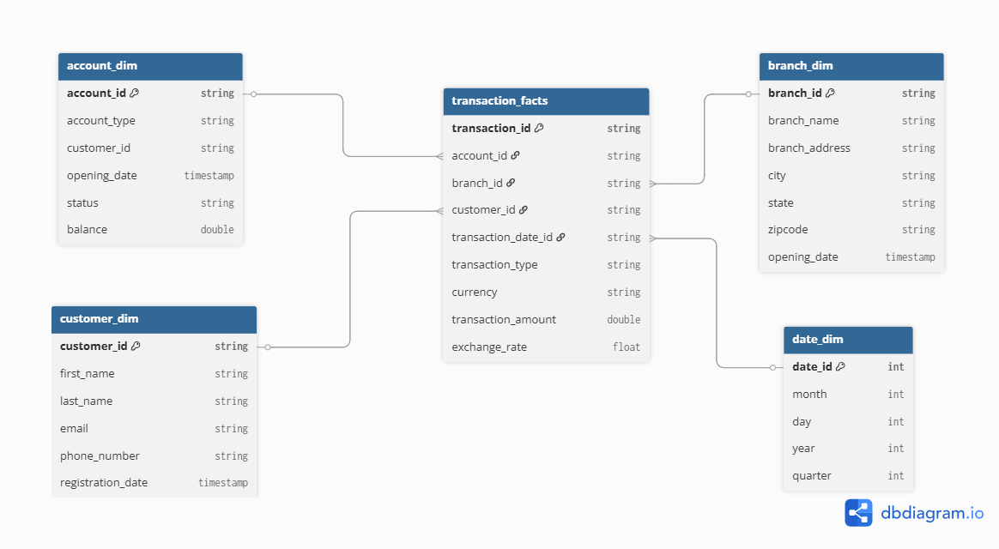

# 💳 Real-Time Data Warehouse for Financial Transactions

This project builds a Real-Time Data Warehouse System for financial transaction data using modern data stack technologies including Apache Airflow, Redpanda, Apache Pinot, PostgreSQL, and Apache Superset.

---

## 📚 Mục tiêu

- Tự động hóa quy trình sinh dữ liệu giao dịch tài chính mô phỏng.
- Đẩy dữ liệu theo thời gian thực (streaming) tới Kafka-compatible broker (Redpanda).
- Tích hợp các công cụ lưu trữ, phân tích và trực quan hóa dữ liệu thời gian thực.
- Thiết kế mô hình Data Warehouse theo kiến trúc Star Schema.

---

## 🏗️ Kiến trúc hệ thống


### Thành phần

- **Financial Institution**: nguồn mô phỏng sinh dữ liệu (bằng Python/Airflow).
- **Apache Airflow**: điều phối pipeline ETL và sinh dữ liệu mô phỏng.
- **Kafka/Redpanda**: nhận dữ liệu streaming từ Airflow.
- **Apache Pinot**: lưu trữ và xử lý dữ liệu streaming thời gian thực.
- **PostgreSQL**: lưu trữ dữ liệu dạng batch.
- **Apache Superset**: công cụ trực quan hóa dữ liệu.
- **Celery**: backend để thực thi các task của Airflow song song.

---

## 🧱 Mô hình dữ liệu


Mô hình được thiết kế theo dạng Star Schema bao gồm:

### 1. Fact Table: `transaction_facts`
Chứa các dữ liệu chính về giao dịch:
- `transaction_id`, `account_id`, `customer_id`, `branch_id`
- `transaction_date_id`, `transaction_type`, `currency`
- `transaction_amount`, `exchange_rate`

### 2. Dimension Tables:
- `account_dim`: thông tin tài khoản
- `customer_dim`: thông tin khách hàng
- `branch_dim`: thông tin chi nhánh ngân hàng
- `date_dim`: thông tin ngày (dạng date dimension)

---

## Docker compose
- redpanda: https://docs.redpanda.com/redpanda-labs/docker-compose/single-broker/
- apache pinot: https://docs.pinot.apache.org/basics/getting-started/running-pinot-in-docker#docker-compose
---

## 🍷 Apache Pinot

- Nhận dữ liệu từ Redpanda theo thời gian thực.
- Cấu hình schema và realtime table để ingest dữ liệu streaming.
- Truy vấn nhanh cho dashboard Superset.

---

## 📊 Apache Superset

- Kết nối trực tiếp đến Apache Pinot để xây dựng biểu đồ và dashboard.
- Hỗ trợ cập nhật theo thời gian thực (live charts).

---

## 🚀 Khởi động hệ thống (Docker-based)

### 1. Clone dự án:
```bash
git clone https://github.com/your-org/financial-rt-data-warehouse.git
cd financial-rt-data-warehouse
```

### 2. Khởi chạy docker-compose:
```bash
docker-compose up -d
```

### 3. Truy cập:
- Airflow: http://localhost:8080
- Superset: http://localhost:8088
- Redpanda Console: http://localhost:8081
- Apache pinot: http://localhost:9000

---

## 🧪 Kiểm thử

- Truy cập Airflow, bật DAG `transaction_facts_generator`.
- Dữ liệu sẽ bắt đầu stream qua Redpanda → Pinot → Superset.
- Mở Superset để tạo biểu đồ thống kê: giao dịch theo ngày, chi nhánh, loại giao dịch,...

